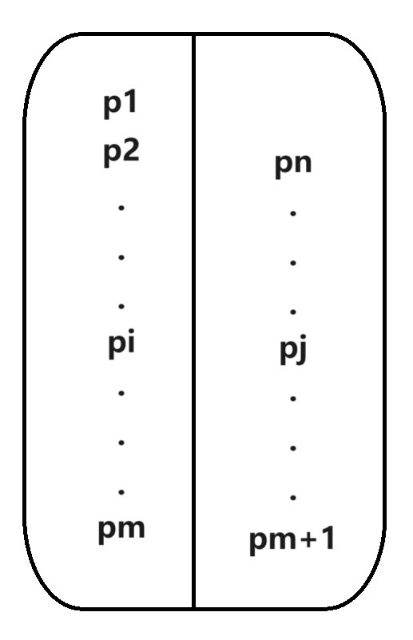
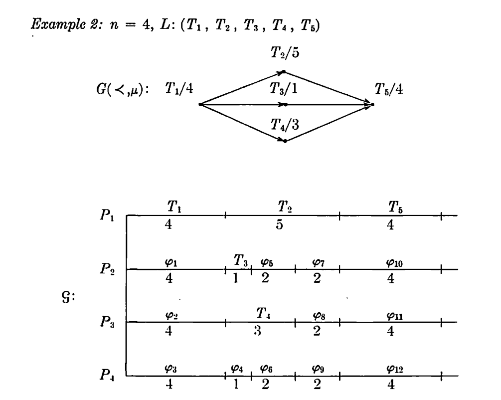

# Exercise 2.1
## 问题描述
给定一个正整数k,一个顶点集$V$和在顶点$i,j$之间的距离$d_{ij}$,令$V=V_{sup}+V_{cust}$,其中suppliers $V_{sup}\subseteq V$,customers $V_{cust}=V-V_{sup}$.其中边权值$d(i,j)$满足三角不等式
$$
\forall i,j\in V_{sup},\forall k,l\in V_{cust}, d_{ik}\leq d_{ij}+d_{jl}+d_{lk}
$$
目标是找到最多k个suppliers,使得每一个customer到相应的supplier的最大距离最小,换言之,目标为找到集合S,满足
$$
S\subseteq V_{sup},|S|\leq k,minimize \max\limits_{j\in D}d(j,S)
$$
其中$V_{cust}(j,S)$的定义如下:
$$
d(j,S)=\min\limits_{i\in S}d(j,i)
$$
该算法的现实意义在于建立一系列供应商,使得所有顾客都至少被其中一个供应商的簇包含,且尽可能缩短顾客到各自供应商的距离的最大值.
问题如下:

1. 给出一个3-近似算法.

2. 证明:除非P=NP,否则不存在$\rho<3$的$\rho-$近似算法.

## 解决证明

1. 
   
   - 算法如下:
     初始化$S=\varnothing$,将距离$V_{sup}$最近的点$i$加入$S$中.
     再选择$V_{cust}$中距离$S$最远的点$j$,将$V_{sup}$中距离$j$最近的点$i$加入$S$中,重复该步骤直至$|S|=k$或无新节点加入.
     最后选择$V_{cust}$中距离$S$最远的点的距离作为最终结果输出.
     
   - 算法近似比证明:
     考虑每一次新加入的点$i$和$V_{sup}$中距离该点最近点形$j$成的有序对$(i,j)$,不妨假设OPT(最优解)中$j$被$V_{sup}$中顶点$i'$包含覆盖.被$i'$覆盖的任一其他顶点为$j'$.由于$i$是距离$j$最近的顶点,故
     $$
     d(i,j')\leq d(i,j)+d(j,i')+d(i',j')\leq 2d(j,i')+OPT\leq 3OPT
     $$
     若存在某一个OPT的簇不包含任意有序对$(i,j)$中的$j$,则必有一个簇$i''$包含两个以上的标记点,设为$j_k,j_s$.则其他点$j''$到当前$S_k$的距离小于新加入的点$j_s$到$S_k$的距离
     $$
     d(j'',S_k)\leq d(j_s,S_k)\leq d(j_s,i_k)\leq d(j_s,i'')+d(i'',j_k)+d(j_k,i_k)\leq 2OPT+d(j_k,i'')\leq3OPT
     $$

2. 
   - 证明不存在更好的近似比算法:
     若不然,考虑k-碰撞集问题:
     
   - 给定集合$S$的一系列子集$D_m=\{S_1,S_2,...S_m\}$,找到一个集合$|S'|\leq k$满足
     $$
     S'\cap S_i\neq\varnothing,\forall i=1,2,...m
     $$
     
   - 令$V_{sup}=S,V_{cust}=D_m$,边权值$C_{ij}$满足
   $$
   C_{ij}=\begin{cases}
       2,\quad\{i,j\}\subseteq V_{sup}\quad or\quad\{i,j\}\subseteq V_{cust},\\
       3,\quad i\in V_{sup}\quad and\quad j\in V_{cust}\quad and\quad i\notin D_j,\\
       1,\quad i\in V_{sup}\quad and\quad j\in V_{cust}\quad and\quad i\in D_j,\\
       \end{cases}
   $$
   -   显然构造的图满足三角不等式,k-碰撞集问题有解等价于存在原问题有解且$OPT=1$.则若存在$\rho<3$的近似算法,导致在多项式时间内找到$OPT*<3$的解,即$OPT=1$,为最优解,证明了P=NP.

# Exercise 2.2
## 问题描述

- 给定m台机器去完成n项任务,要求同一时间一台机器只能进行一项任务,且一旦开始某项任务机器就不能停止知道该任务完成.现设没想任务$j$的完成所需时间为$p_j$,每项任务的完成时刻为$C_j$.要求给出一种任务的安排策略,使得$C_{max}=\max\limits_{j=1,2,..n}C_j$最小.

- 先给出一种$\frac{4}{3}$-近似算法:
  首先将任务按完成所需时间从大到小进行排列,再依次将任务安排至当前完成时刻最短的机器上.
  
- 最后完成的任务为任务n,其开始进行的时间为$S_n$,OPT的解为$C_{max}'$,则在任务n开始之所有机器都是忙碌的,即
	$$
	S_n\leq \frac{1}{m}\sum\limits_{i=1}^{n-1}p_i \tag1
	$$
	
- 又OPT解显然满足
	$$
	C_{max}'\leq \frac{1}{m}\sum\limits_{i=1}^{n}p_i \tag2
	$$
	
- ``若$p_n\leq C_{max}'/3$,将$(1)$$(2)$式带入,则该算法得到的解为
    $$
    C_{max}=S_n+p_n \leq \frac{1}{m}\sum\limits_{i=1}^{n-1}p_i+p_n\leq (1-\frac{1}{m})p_n+\frac{1}{m}\sum\limits_{i=1}^{n}p_i\leq(\frac{4}{3}-\frac{1}{3m})C_{max}'\leq \frac{4}{3}C_{max}'
	$$
	
- 若$p_n>C_{max}'/3$,证明此时使用上述算法得到的解即为最优解

## 解决证明

此时显然每台机器上最多只能完成两项任务,若$n\leq m$则显然为最优解,我们考虑$m<n\leq 2m$.若不然,如果该算法得到的解为$p_1$,则显然为最优解.如果得到的解$C_{max}=p_i+p_j,(i<j)$,设存在其他安排策略使得结果更优,则我们规定原算法为$old$,新算法为$new$.设$new$中与$p_j$对应得任务为$k$,即$k>i$.

若$k<j$,则在$l=i+1,...j-1$中至少会多余一项任务不能在这个范围内配对,设为$p_l$.其显然不能与$l'<i$的$p_{l'}$配对,因为
$$
p_l+p_{l'}>p_j+p_i=C_{max}
$$
则其只能与$s>j$的任务匹配.导致$old$中与$s$配对的$p_{s'}$孤立.其最终只能选择$[1:i-1]$的任务匹配,仍会导致矛盾

若$k>j$,则同样会导致$old$中与$k$配对的$p_{k'}$孤立,之后同上.

综上,当$p_n>C_{max}'/3$时,不存在比原算法得到的更好的不同解.

# Exercise 2.3
## 问题描述

在Exercise 2.2的基础上规定优先顺序,即每个工作$j$都有某些自己对应的前置工作$i$,记为$i\prec j$.现给出一种算法,每当有机器空闲时,检查当前是否存在可以执行的任务,有则将其安排到该任务上,证明该算法是一个2-近似算法.

## 解决证明

对于该算法得出的一个解,构造一个任务序列$T_k$如下:
选择完成任务时刻最晚的任务作为$T_1$,令$\varphi_1$为$T_1$开始进行前空闲时间段结束时刻最晚的空闲时间段(只要存在某一时刻一项任务完成就划分一段空闲时间),即$\varphi_1$的技术时间一定一某一个任务的结束时间,将该任务作为$T_2$加入序列,以此类推.最终构造出的任务序列,我们证明其满足
$$
T_1\succ T_2\succ ...\succ T_k
$$
若不然,则在$\varphi_i$时间段中$T_i$也能进行,矛盾.故在任一空闲时间段的时刻都至少存在一台机器进行$T_i$,即该算法的解
$$
C_{max}=\sum\limits_{j=1}^{k}P(T_j)+\sum P_{no-free}\tag1
$$
其中$P_{no-free}$表示非空闲时间段持续的时间,又
$$
OPT\geq \sum\limits_{j=1}^{n}P(T_j),OPT\geq \sum\limits_{j=1}^{n}P(T_j)/m\geq\sum P_{no-free}\tag2
$$
联立$(1)(2)$,得
$$
C_{max}\leq OPT+OPT\leq 2OPT
$$

# Exercise 2.5

## 问题描述

在最小斯坦纳树问题中，给定一个完全无向图$G=(V,E)$且边权值非负,满足
$$
c_{ij}\geq 0,(i,j)\in E
$$
顶点集$V$被分为终端点集$R$和非终端点集$V-R$,目标是找到一个最小树,包含所有终端点,使得所得树得权值最小.现给出如下问题:

1. 假定边权值满足三角不等式,即

$$
c_{ij}\leq c_{ik}+c_{kj},\forall i,j,k\in V
$$
​	令$G[R]$为$G$上$R$的生成子图,包含所有$R$中顶点和$G$中端点都属于$R$的边.在$G[R]$中得到一个最小生成树,证明这样的算法是一个2-近似算法.

2. 如果现在边权值不满足三角不等式,且图$G$不是完全图但是连通的.创建一个新图$G'=(V,E')$,满足
$$
c_{ij}'=
\begin{cases}
c_{ij}\quad (i,j)\in E\\
(p_{ij})_{min}\quad (i,j)\notin E
\end{cases}
$$

​	其中$(p_{ij})_{min}$表示$G$中从顶点$i$到$j$的最短路径长.现在在图$G'$中使用之前的算法得到一棵树$T'$.为在原始的图$G$中也得到一棵树$T$,将$T'$中所有在$p_{ij}$上的边加入$T$中,证明该算法也是一个2-近似算法.$G'$也被称为图$G$的一个完全度量.

## 解决证明

1. 设原问题的最优解为OPT,算法得到的解为$OPT^*$.设OPT中的点集为$R'$,则新加入的点(也叫斯坦纳点)集为$R'-R$.将OPT中得到的树的所有边复制一遍,自然得到一条欧拉回路,将该回路中涉及到斯坦纳点的边跳过(short-cutting),即
$$
C_i-C_{i+1}-C_{i+2}-...-C_j\Rightarrow C_i-C_j \quad C_k为斯坦纳点,k=i+1,i+2,...j-1
$$
​		这样得到的回路显然$G[R]$上的一个回路$S$,将其去掉任意一条边即可得到$G[R]$上的一个生成树$T$,其权值满足
$$
OPT^*=T_{min}\leq T<S=2OPT
$$

2. 由于生成的图$G'$显然满足之前的图的要求,故可以运用之前的算法得到,满足
   $$
   cost(T')\leq 2OPT(G') \tag1
   $$
   又因为$c_{ij}'\leq c_{ij}$,故
   $$
   OPT(G')\leq OPT(G) \tag2
   $$
   由于$T$是由$T'$等效代替其中边得到的,故
   $$
   cost(T)\leq cost(T') \tag3
   $$
   联立$(1)(2)(3)$,得到最终的证明
   $$
   cost(T)\leq 2OPT(G)
   $$

# Exercise 2.9

## 问题描述

再次考虑斯坦纳树问题,给定一个无向图$G=(V,E)$和一些终端点的集合$R\subseteq V$.一棵包含所有终端点的树称为斯坦纳树,设该问题最优解的最大度为OPT,试给出一种多项式时间内的算法,找到一颗最大度尽可能小的斯坦纳树,满足其最大度
$$
\Delta(T)\leq 2OPT+\lceil log_2n\rceil
$$

## 解决证明

- 首先给出一些定义方便之后的证明.令$l=\lceil log_2n\rceil$,$\Delta(T)$为$T$的最大度,$d_T(u)$为顶点$u$的度数

- 给出如下算法:
  - 考虑任意一颗$G$中的斯坦纳树,将其进行如下操作(该算法也称为局部搜索算法):
    - 去掉所有无用边,即每条边被删去后形成的连通分量中至少要有一个顶点$u\in R$.
    - 考虑任意节点度数大于$\Delta(T)-l$的节点$u$和与其对应的一条边$(u,y)$,检查所有端点不在树$T$中但加入后可以和$(u,y)$形成环的路径$p_{(v,w)}$.若$max(d_T(v),d_T(w))\leq d_T(u)-2$,则将边$(u,y)$删去后再加入路径$p_{(v,w)}$,使得最大度减小.如此循环下去,直至无操作可行.

- 证明该算法的上界:

  - 对于$i\geq \Delta(T)-l+1$,令$S_i$为$T$中所有度数至少为$i$的顶点集,则与其中顶点相关联的边至多有$i|S_i|-(|S_i|-1)$条,且删去这些边以后得到的连通分量之间可连接的边的关联点的度数至少为$i-1$(若不然则可以进行再优化,不满足局部最优的条件).我们说明至少存在一个$i$使得$|S_{i-1}|\leq 2|S_i|$.若不然则有
  $$
  |S_{\Delta(T)-l}|>2^l|S_{\Delta(T)}|>n|S_{\Delta(T)}|\geq n
  $$
  - 但最多只存在n个顶点,矛盾.
  - 考虑删去这$i|S_i|-(|S_i|-1)$条关联边后,$S_{i-1}$与所有可连接这$i|S_i|-(|S_i|-1)+1$个连通分量的边都相关联,则其中$S_{i-1}$的顶点的平均度数显然低于最优解OPT,即满足
  $$
  OPT\geq \frac{i|S_i|-(|S_i|-1)}{|S_{i-1}|}\geq \frac{(i-1)|S_i|+1}{2|S_i|}>(i-1)/2\geq(\Delta(T)-l)/2
  $$
  
- 再证明该算法是一个多项式时间内的算法:

  - 构造一个势能函数判断当前树的状态,定义为
    $$
    \Phi(T)=\sum\limits_{v\in V}3^{d_T(v)}
    $$
    
  - 考虑该函数的上下界,有
  	$$
  	\Phi(T)\leq n3^{\Delta(T)}\leq n3^n \quad \Phi(T)\geq 2\cdot3^1+(n-2)\cdot 3^2>n
  	$$
  	每次运行一遍如上的操作后,对于$i\geq \Delta(T)-l$,都至少将一个度数为$i$的顶点度数减一,度数为$i-2$的两个顶点度数加一,即最终$\Phi(T)$减少
    $$
    (3^i-3^{i-1})-2\cdot (3^{i-1}-3^{i-2})=2\cdot3^{i-2}\geq \frac{2}{9}3^{\Delta(T)-l}\geq \frac{2}{27n^3}\Phi(T)
    $$
    故在至多$\frac{27}{2}n^4$次操作以后,势能函数变为
    $$
    (1-\frac{2}{27n^3})^{\frac{27}{2}n^4}\cdot n3^n\leq e^{-nln3}\cdot n3^n\leq n
    $$
    即只需$O(n^4)$次操作即可得到局部最优解,满足多项式时间内算法.
# Exercise 2.10

## 问题描述

给定一个集合$E$包含一系列元素,对于$S\subseteq E$,令$f(S)$为集合$S$的价值,$f(\empty)=0$,称$f$是单调的若满足
$$
\forall S\subseteq T\subseteq E,f(S)\leq f(T)
$$
称$f$是次模的若满足
$$
\forall S,T\subseteq E,f(S)+f(T)\geq f(S\cap T)+f(S\cup T) \tag0
$$
求找到一个最大价值的子集$T\subseteq E$满足$|T|\leq k$.给出一个如下的贪婪算法:
初始化$T=\varnothing$,每次选择能使当前$f(T)$增加最多的元素加入,即加入的元素$a_i$满足
$$
\max\limits_{i=1,2,...|E|}\quad f(T\cup \{a_i\})-f(T)
$$
证明该算法是一个$(1-\frac{1}{e})$-近似算法.

## 解决证明

设最优解为$T_{OPT}$,第$i$次迭代后得到的解为$T_i$,则假设下式成立
$$
f(T_i\cup \{a_i\})-f(T_i)\geq \frac{1}{k}(f(T_{OPT})-f(T_i)) \tag1
$$
则有
$$
f(T_{i+1})\geq \frac{1}{k}f(T_{OPT})+(1-\frac{1}{k})f(T_i) \tag2
$$
由于$f(T_0)=f(\empty)=0$,反复迭代$(2)$式,,得到
$$
f(T_k)\geq f(T_{OPT})(1-(1-\frac{1}{k})^k)\geq 	f(T_{OPT})(1-\frac{1}{e})
$$
得证,下面证明$(1)$式成立.由单调性可知,$f(T_{OPT})\leq f(T_{OPT}\cup T_i)$,令
$$
T_{OPT}-T_{i}=\{i_1,i_2,...,i_p\},\quad p \leq|T_{OPT}|=k
$$
则
$$
f(T_{OPT}\cup T_i)=f(T_i)+\sum\limits_{j=1}^{p}[f(T_{i}\cup \{i_1,...i_j\})-f(T_i\cup \{i_1,...i_{j-1}\})] \tag3
$$

由$f$的次模性可知,令$S=T_i\cup \{i_j\},T=T_i\cup\{i_1,...,i_{j-1}\}$,带入$(0)$式中,得

$$
f(T_i\cup \{i_j\})-f(T_i)\geq f(T_i\cup \{i_1,...,i_{j}\})-f(T_i\cup\{i_1,...,i_{j-1}\}) \tag4
$$
再将$(4)$式代入$(3)$式中,得到
$$
f(T_{OPT}\cup T_i)\leq f(T_i)+\sum\limits_{j=1}^p[f(T_i\cup \{i_j\})-f(T_i)]\leq f(T_i)+k(f(T_i\cup \{a_i\})-f(T_i))
$$
得证,故原问题获证.

# Exercise 2.11

## 问题描述

在最大集合覆盖问题中,给定一个集合$E$和$m$个子集$S_1,S_2,...S_m\subseteq E$.每个子集对应有一个非负权重$w_j\geq 0,j=1,2,...m$.目标是选择一个包含$k$个元素得集合$S$以最大化覆盖集合得总权值.我们定义覆盖为如下:若$S\cap S_i\neq \varnothing$,则称集合$S_i$被覆盖.试给出一个$(1-\frac{1}{e})$近似算法.

## 解决证明

该贪婪算法步骤如下:

每次选择一个元素,使得加入后的$S$覆盖集合的总权值增加最多.令$f(S)$为集合$S$对应的覆盖集合总权值,我们证明该函数是符合Exercise 2.10中的函数性质的.

显然,$f$是一个单调函数,每次加入新的元素后总权值至少不会降低.我们证明其次模性的另一个等价性质
$$
\forall X\subseteq Y\subseteq S,\forall l\in S, f(X\cup\{l\})-f(X)\geq f(Y\cup\{l\})-f(Y) \tag{*}
$$
在一个集合$X$加入元素$l$后产生的$\Delta f$,来自于那些包含元素$l$的集合,显然$X$越小,其覆盖的集合含有$l$元素的集合越多,即至少不会比$X\subseteq Y$的集合$Y$覆盖的集合中含有$l$元素的集合多,故其增加的权值也会更多.

令$S=X\cup \{l\},T=Y$,可以从Exercise2.10中$(0)$式推导出$(*)$式.反复迭代$(*)$式,同样可以推导出$(0)$式,故$(*)$式和$(0)$式是等价的,故该问题得证.

